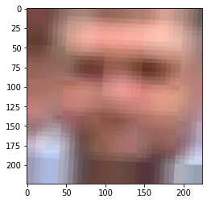
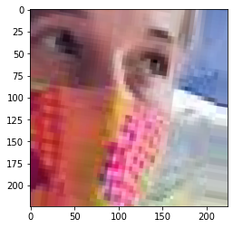

# Mask Detector CNN

```
Run the code directly in colab using the below link
```

<a href="https://colab.research.google.com/github/revanth-reddy/mask-detector-cnn/blob/master/mask.ipynb" target="_parent"></a>

```

If running in local machine, make sure that you have matplotlib, numpy, PIL and tensorflow pre-installed in your system.
The entire project is written in Python 3.8. Use the same for error-free compilation.

```

```
The CNN uses a sequential model and has 10 layers and their structure is as follows
  layers.experimental.preprocessing.Rescaling(1./255, input_shape=(img_height, img_width, 3)),
  layers.Conv2D(16, 3, padding='same', activation='relu'),
  layers.MaxPooling2D(),
  layers.Conv2D(32, 3, padding='same', activation='relu'),
  layers.MaxPooling2D(),
  layers.Conv2D(64, 3, padding='same', activation='relu'),
  layers.MaxPooling2D(),
  layers.Flatten(),
  layers.Dense(128, activation='relu'),
  layers.Dense(num_classes)
```

```
# Code starts from below
import matplotlib.pyplot as plt
import numpy as np
import os
import PIL
import tensorflow as tf

from tensorflow import keras
from tensorflow.keras import layers
from tensorflow.keras.models import Sequential
import pathlib
```


```
train_data = pathlib.Path("Face Mask Dataset/Train")
test_data = pathlib.Path("Face Mask Dataset/Test")
val_data = pathlib.Path("Face Mask Dataset/Validation")

image_count = len(list(train_data.glob('*/*.png')))
print(image_count)

image_count = len(list(test_data.glob('*/*.png')))
print(image_count)

image_count = len(list(val_data.glob('*/*.png')))
print(image_count)


```

    10000
    992
    800


```
mask = list(train_data.glob('WithMask/*'))
PIL.Image.open(str(mask[0]))

# with mask image datasetset first image
```


```
wmask = list(train_data.glob('WithoutMask/*'))
PIL.Image.open(str(wmask[0]))

# without mask image datasetset first image
```


```
batch_size = 32
img_height = 180
img_width = 180
```


```
train_ds = tf.keras.preprocessing.image_dataset_from_directory(
  train_data,
  seed=123,
  image_size=(img_height, img_width),
  batch_size=batch_size)
```

    Found 10000 files belonging to 2 classes.


```
val_ds = tf.keras.preprocessing.image_dataset_from_directory(
  val_data,
  seed=123,
  image_size=(img_height, img_width),
  batch_size=batch_size)
```

    Found 800 files belonging to 2 classes.


```
class_names = train_ds.class_names
print(class_names)
```

    ['WithMask', 'WithoutMask']


```
#First 9 images of dataset
import matplotlib.pyplot as plt

plt.figure(figsize=(10, 10))
for images, labels in train_ds.take(1):
  for i in range(9):
    ax = plt.subplot(3, 3, i + 1)
    plt.imshow(images[i].numpy().astype("uint8"))
    plt.title(class_names[labels[i]])
    plt.axis("off")
```


```
for image_batch, labels_batch in train_ds:
  print(image_batch.shape)
  print(labels_batch.shape)
  break
```

    (32, 180, 180, 3)
    (32,)


```
'''
Let's make sure to use buffered prefetching so we can yield data from disk without having I/O become blocking. These are two important methods you should use when loading data.

Dataset.cache() keeps the images in memory after they're loaded off disk during the first epoch. This will ensure the dataset does not become a bottleneck while training your model. If your dataset is too large to fit into memory, you can also use this method to create a performant on-disk cache.

Dataset.prefetch() overlaps data preprocessing and model execution while training
'''
AUTOTUNE = tf.data.experimental.AUTOTUNE

train_ds = train_ds.cache().shuffle(1000).prefetch(buffer_size=AUTOTUNE)
val_ds = val_ds.cache().prefetch(buffer_size=AUTOTUNE)
```


```
normalization_layer = layers.experimental.preprocessing.Rescaling(1./255)
```


```
normalized_ds = train_ds.map(lambda x, y: (normalization_layer(x), y))
image_batch, labels_batch = next(iter(normalized_ds))
first_image = image_batch[0]
# Notice the pixels values are now in `[0,1]`.
print(np.min(first_image), np.max(first_image)) 
```

    0.0 1.0


```
# Model

num_classes = 5

model = Sequential([
  layers.experimental.preprocessing.Rescaling(1./255, input_shape=(img_height, img_width, 3)),
  layers.Conv2D(16, 3, padding='same', activation='relu'),
  layers.MaxPooling2D(),
  layers.Conv2D(32, 3, padding='same', activation='relu'),
  layers.MaxPooling2D(),
  layers.Conv2D(64, 3, padding='same', activation='relu'),
  layers.MaxPooling2D(),
  layers.Flatten(),
  layers.Dense(128, activation='relu'),
  layers.Dense(num_classes)
])

```


```
model.compile(optimizer='adam', loss=tf.keras.losses.SparseCategoricalCrossentropy(from_logits=True), metrics=['accuracy'])
```


```
# Model SUmmary

model.summary()
```

    Model: "sequential_1"
    _________________________________________________________________
    Layer (type)                 Output Shape              Param #   
    =================================================================
    rescaling_3 (Rescaling)      (None, 180, 180, 3)       0         
    _________________________________________________________________
    conv2d_3 (Conv2D)            (None, 180, 180, 16)      448       
    _________________________________________________________________
    max_pooling2d_3 (MaxPooling2 (None, 90, 90, 16)        0         
    _________________________________________________________________
    conv2d_4 (Conv2D)            (None, 90, 90, 32)        4640      
    _________________________________________________________________
    max_pooling2d_4 (MaxPooling2 (None, 45, 45, 32)        0         
    _________________________________________________________________
    conv2d_5 (Conv2D)            (None, 45, 45, 64)        18496     
    _________________________________________________________________
    max_pooling2d_5 (MaxPooling2 (None, 22, 22, 64)        0         
    _________________________________________________________________
    flatten_1 (Flatten)          (None, 30976)             0         
    _________________________________________________________________
    dense_2 (Dense)              (None, 128)               3965056   
    _________________________________________________________________
    dense_3 (Dense)              (None, 5)                 645       
    =================================================================
    Total params: 3,989,285
    Trainable params: 3,989,285
    Non-trainable params: 0
    _________________________________________________________________


```
# Training the Model

epochs=10
history = model.fit(
  train_ds,
  validation_data=val_ds,
  epochs=epochs
)
```

    Epoch 1/10
    313/313 [==============================] - 292s 933ms/step - loss: 0.1168 - accuracy: 0.9524 - val_loss: 0.1563 - val_accuracy: 0.9438
    Epoch 2/10
    313/313 [==============================] - 291s 930ms/step - loss: 0.0458 - accuracy: 0.9846 - val_loss: 0.0578 - val_accuracy: 0.9812
    Epoch 3/10
    313/313 [==============================] - 290s 925ms/step - loss: 0.0316 - accuracy: 0.9888 - val_loss: 0.0426 - val_accuracy: 0.9862
    Epoch 4/10
    313/313 [==============================] - 291s 929ms/step - loss: 0.0264 - accuracy: 0.9907 - val_loss: 0.0527 - val_accuracy: 0.9825
    Epoch 5/10
    313/313 [==============================] - 289s 922ms/step - loss: 0.0190 - accuracy: 0.9934 - val_loss: 0.0159 - val_accuracy: 0.9937
    Epoch 6/10
    313/313 [==============================] - 291s 930ms/step - loss: 0.0150 - accuracy: 0.9946 - val_loss: 0.0211 - val_accuracy: 0.9950
    Epoch 7/10
    313/313 [==============================] - 289s 922ms/step - loss: 0.0144 - accuracy: 0.9947 - val_loss: 0.0343 - val_accuracy: 0.9912
    Epoch 8/10
    313/313 [==============================] - 290s 926ms/step - loss: 0.0133 - accuracy: 0.9953 - val_loss: 0.0249 - val_accuracy: 0.9900
    Epoch 9/10
    313/313 [==============================] - 287s 916ms/step - loss: 0.0189 - accuracy: 0.9933 - val_loss: 0.0341 - val_accuracy: 0.9862
    Epoch 10/10
    313/313 [==============================] - 290s 927ms/step - loss: 0.0039 - accuracy: 0.9988 - val_loss: 0.0210 - val_accuracy: 0.9950


```
# Visualizing the Results

acc = history.history['accuracy']
val_acc = history.history['val_accuracy']

loss=history.history['loss']
val_loss=history.history['val_loss']

epochs_range = range(epochs)

plt.figure(figsize=(8, 8))
plt.subplot(1, 2, 1)
plt.plot(epochs_range, acc, label='Training Accuracy')
plt.plot(epochs_range, val_acc, label='Validation Accuracy')
plt.legend(loc='lower right')
plt.title('Training and Validation Accuracy')

plt.subplot(1, 2, 2)
plt.plot(epochs_range, loss, label='Training Loss')
plt.plot(epochs_range, val_loss, label='Validation Loss')
plt.legend(loc='upper right')
plt.title('Training and Validation Loss')
plt.show()
```


```
# Prediction

import matplotlib.pyplot as plt
import matplotlib.image as mpimg


test = list(test_data.glob('WithMask/*'))

count = 0
for test_img in test:
  test_data_path = str(test_img)
  img = keras.preprocessing.image.load_img(
      test_data_path, target_size=(img_height, img_width)
  )
  img_array = keras.preprocessing.image.img_to_array(img)
  img_array = tf.expand_dims(img_array, 0) # Create a batch

  predictions = model.predict(img_array)
  score = tf.nn.softmax(predictions[0])
  if class_names[np.argmax(score)]!='WithMask':
    count+=1
    img = mpimg.imread(test_data_path)
    imgplot = plt.imshow(img)
    plt.show()
    print(test_data_path, 100 * np.max(score))

print(count,"/",len(test))
```


    Face Mask Dataset/Test/WithMask/Augmented_99_5504654.png 84.18315649032593


    Face Mask Dataset/Test/WithMask/Augmented_353_5799649.png 93.41042041778564


    Face Mask Dataset/Test/WithMask/1163.png 85.96945405006409


    Face Mask Dataset/Test/WithMask/Augmented_689_9677847.png 62.2393012046814


    Face Mask Dataset/Test/WithMask/45.png 99.60734844207764





    Face Mask Dataset/Test/WithMask/Augmented_890_8528242.png 55.154067277908325


    Face Mask Dataset/Test/WithMask/Augmented_187_5733934.png 98.73288869857788





    Face Mask Dataset/Test/WithMask/Augmented_30_1910857.png 99.68444108963013
    8 / 483


```
# Prediction

test = list(test_data.glob('WithoutMask/*'))

count = 0
for test_img in test:
  test_data_path = str(test_img)
  img = keras.preprocessing.image.load_img(
      test_data_path, target_size=(img_height, img_width)
  )
  img_array = keras.preprocessing.image.img_to_array(img)
  img_array = tf.expand_dims(img_array, 0) # Create a batch

  predictions = model.predict(img_array)
  score = tf.nn.softmax(predictions[0])
  if class_names[np.argmax(score)]!='WithoutMask':
    count+=1
    img = mpimg.imread(test_data_path)
    imgplot = plt.imshow(img)
    plt.show()
    print(test_data_path, 100 * np.max(score))

print(count,"/",len(test))
```


    Face Mask Dataset/Test/WithoutMask/5138.png 98.63139390945435


    Face Mask Dataset/Test/WithoutMask/3372.png 94.591224193573


    Face Mask Dataset/Test/WithoutMask/51.png 80.50980567932129


    Face Mask Dataset/Test/WithoutMask/3004.png 71.36699557304382


    Face Mask Dataset/Test/WithoutMask/1028.png 62.601399421691895
    5 / 509


```
test = list(test_data.glob('WithoutMask/*'))

test_data_path = str(test[0])
img = keras.preprocessing.image.load_img(
    test_data_path, target_size=(img_height, img_width)
)
img_array = keras.preprocessing.image.img_to_array(img)
img_array = tf.expand_dims(img_array, 0) # Create a batch

predictions = model.predict(img_array)
score = tf.nn.softmax(predictions[0])

print(
    "This image most likely belongs to {} with a {:.2f} percent confidence."
    .format(class_names[np.argmax(score)], 100 * np.max(score))
)
```

    This image most likely belongs to WithoutMask with a 100.00 percent confidence.


```
# Saving Model

model.save('saved_model/')
```

    INFO:tensorflow:Assets written to: saved_model/assets


```
# Load the saved model and predict

from tensorflow import keras
model = keras.models.load_model('saved_model')

```


```
# test the loaded model

test = list(test_data.glob('WithMask/*'))

test_data_path = str(test[0])
img = keras.preprocessing.image.load_img(
    test_data_path, target_size=(img_height, img_width)
)
img_array = keras.preprocessing.image.img_to_array(img)
img_array = tf.expand_dims(img_array, 0) # Create a batch

predictions = model.predict(img_array)
score = tf.nn.softmax(predictions[0])

print(
    "This image most likely belongs to {} with a {:.2f} percent confidence."
    .format(class_names[np.argmax(score)], 100 * np.max(score))
)

```

    This image most likely belongs to WithMask with a 100.00 percent confidence.

